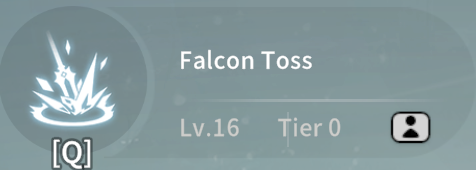
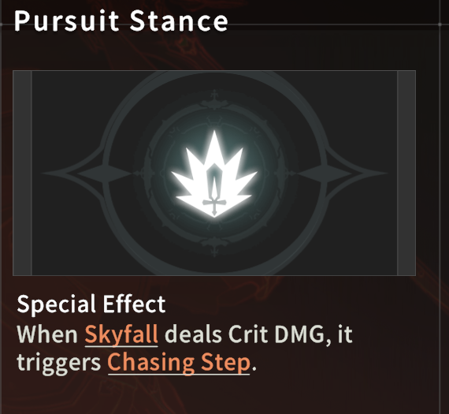
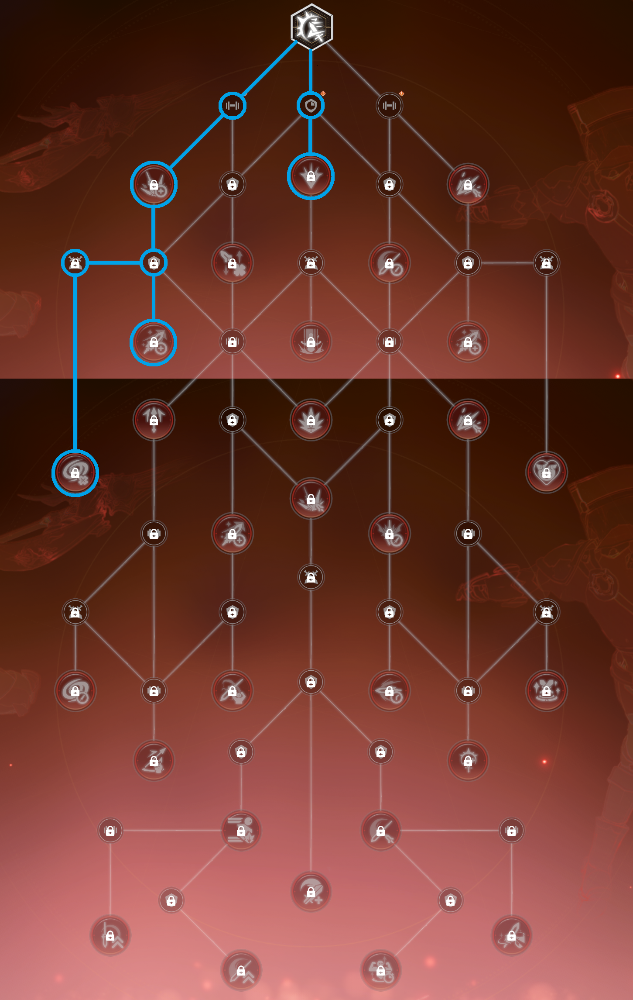
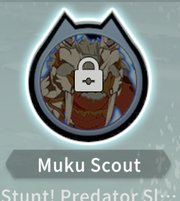

# BPSR: Skyward (Aerial) Wind Knight Comprehensive Guide

* [Video Version of This Guide](#video-version-of-this-guide)
* [Intro](#intro)
* [Skills](#skills)
  * [TLDR: Advance Order (the one that uses skill books)](#tldr-advance-order-the-one-that-uses-skill-books)
  * [Basic Attack (Left click)](#basic-attack-left-click)
  * [Skyfall](#skyfall)
  * [Typhoon Cleave](#typhoon-cleave)
  * [Falcon Toss](#falcon-toss)
  * [Instant Edge](#instant-edge)
  * [Galeform](#galeform)
  * [Sharp Impact](#sharp-impact)
* [Class Resources](#class-resources)
  * [Courage](#courage)
  * [Sharp](#sharp)
  * [Chasing Step](#chasing-step)
* [Key Buffs](#key-buffs)
  * [Wind Fury](#wind-fury)
  * [Galeform Buff](#galeform-buff)
  * [Wind and Thunder](#wind-and-thunder)
* [Skill Tree](#skill-tree)
  * [Key Nodes](#key-nodes)
    * [Tornado](#tornado)
    * [Instant Edge Combo Node](#instant-edge-combo-node)
    * [Azure Sever Node](#azure-sever-node)
    * [Chasing Step Node](#chasing-step-node)
    * [Sharp Impact Node](#sharp-impact-node)
    * [Wind Fury Node](#wind-fury-node)
  * [Skilltree Build](#skilltree-build)
    * [Leveling Up Builds](#leveling-up-builds)
      * [Day 3, Level 33, Talent Points 35](#day-3-level-33-talent-points-35)
      * [Day 4, Level 38, Talent Points 39](#day-4-level-38-talent-points-39)
      * [Day 5, Level 42, Talent Points 42](#day-5-level-42-talent-points-42)
      * [Day 6, Level 47, Talent Points 46](#day-6-level-47-talent-points-46)
      * [Day 7, Level 50, Talent Points 52](#day-7-level-50-talent-points-52)
      * [Day 8, Level 53, Talent Points 56](#day-8-level-53-talent-points-56)
      * [Day 9, Level 56, Talent Points 57](#day-9-level-56-talent-points-57)
      * [Day 10, Level 57, Talent Points 59](#day-10-level-57-talent-points-59)
      * [Day 11, Level 58, Talent Points 62](#day-11-level-58-talent-points-62)
      * [Day 12, Level 59, Talent Points 64](#day-12-level-59-talent-points-64)
      * [Day 14, Level 60, Talent Points 66](#day-14-level-60-talent-points-66)
      * [Day 17, Level 60, Talent Points 68](#day-17-level-60-talent-points-68)
    * [Recommended Build](#recommended-build)
    * [Other Builds](#other-builds)
* [Rotation](#rotation)
  * [Courage Management and Other Nuances](#courage-management-and-other-nuances)
* [Gear and Stats](#gear-and-stats)
  * [Stats](#stats)
    * [Crit](#crit)
    * [Haste](#haste)
    * [Luck](#luck)
  * [Lv60 Gear & Gems](#lv60-gear--gems)
  * [Lv80 Gear & Gems](#lv80-gear--gems)
* [Imagines](#imagines)
  * [Whale Imagines](#whale-imagines)
  * [F2P / Low Spender Imagines](#f2p--low-spender-imagines)
  * [Celestial Flyer](#celestial-flyer)
* [Modules](#modules)
* [Updates](#updates)
* [Footnote](#footnote)

## Video Version of This Guide

[https://youtu.be/rotHMENL6Ek](https://youtu.be/rotHMENL6Ek)

## Intro

The Skyward (Aerial) Wind Knight is a melee dps with a unique mechanic where you stay in the air half the time during combat. While in the air you can avoid a lot of gound based patterns and boss attacks. The class has great AOE damage and respectable single target damage, but it lacks any sort of interrupt or mob grouping abilities.

This class uses strength gear, which is the same type of gear both tank classes use. If you also want to play tank along side this class without too much min maxing on the tank, then you would only need to farm a tank weapon and be good to go.

This class is not the top dps class, if you want to play a top dps class I recommend you play Marksman (Bow) instead.

## Skills

### TLDR: Advance Order (the one that uses skill books)

[Instant Edge](#instant-edge) > [Galeform](#galeform) > [Skyfall](#skyfall) >>> [Falcon Toss](#falcon-toss) = [Sharp Impact](#sharp-impact) >>> Basic attack = Ult

For skill upgrade (the one that cost bound luno) just upgrade everything to max

### Basic Attack (Left click)

- Advance Priority: no need to upgrade
- Bascially never use this skill with proper rotation.

### Skyfall

- Advance Priority: 3
- Main skill to generate [Sharp stacks](#sharp) and to proc [Chasing Step](#chasing-step).

### Typhoon Cleave

- Advance Priority: no need to upgrade
- Used for regenerate [Courage](#courage), not used for damage.

### Falcon Toss

- Advance Priority: 4
- Generally not used in regular rotation, only use once per [Wind Fury](#wind-fury) when Azure Sever is available.

### Instant Edge

- Advance Priority: 1
- This is one of the main damage source for the class, consumes [Sharp stacks](#sharp) on cast, and consumes [Chasing Step Stack](#chasing-step) on hit.
- This skill is also how you recharge [Sharp Impact](#sharp-impact).
- During [Wind Fury](#wind-fury) this skill will generate [Tornado](#tornado) on hit.
    - If skill is used while in the air 1 [Tornado](#tornado) will be generated.
    - If skill is used while standing on the ground 2 [Tornados](#tornado) will be generated, but animation will be longer.
- This skill is used to proc [Instant Edge Combo](#instant-edge-combo-node).

### Galeform

- Advance Priority: 2
- Used to activate [Galeform Buff](#galeform-buff), has 2 charges with 30s CD.
- Upgrading this skill increases the damage that it buffs, which affects all damage sources, thus upgrade priority 2.

### Sharp Impact

- Advance Priority: 4
- The skill's damage is negligible, used to activate the 15s [Wind Fury](#wind-fury) buff.
- When casting this skill while standing on the ground, your character will first teleport directly above your target and then crash down, this initial part of teleporting above the target has quite a long animation, but it can be skipped entirely by doing a jump before casting the skill. This jump cancel tech is incorporated as part of the [rotation](#rotation).

## Class Resources

### Courage

- Naturally recharges 3 per second.
- With [Galeform Buff](#galeform-buff) active, it recharges additionally 7 per second.
- When [Galeform Buff](#galeform-buff) is under [Wind Fury](#wind-fury), the additional 7 per second rechange changes to 10 per second.
- Galeform recharge ticks and natural recharge ticks are independent.

### Sharp

- Each stack lasts 10 seconds, when it times out you will lose 1 stack, and when this happens it will still charge [Sharp Impact](#sharp-impact) by 5%.
- Each stack gives +5% attack, and for Aerial Wind Knight, having any stack will automatically give the max stack amount of attack bonus. This means (assuming all Sharp cap nodes are activated so Sharp cap is 6) having only 1 stack of Sharp will give `5% x 6 = 30%` Attack bonus.
- Due to this mechanism, you want to always keep 1 stack of Sharp. And DOT damages (i.e. tornado ticks) are calculated based on the time of the tick and not at the time of the initial tornado's creation, if you are unable to keep at least 1 stack of Sharp, your on field tornados' damage will suffer.

### Chasing Step

| 1 Stack               | 2 Stacks              |
|:----------------------|:----------------------|
|  |  |

- This buff is triggered when [Skyfall](#skyfall) crits, can stack up to 2 times.
- When a stack is consumed by [Instant Edge](#instant-edge) it refunds 1 [Sharp](#sharp).
- When a stack is consumed by [Instant Edge](#instant-edge) it doubles the amount of [Sharp Impact](#sharp-impact) charge.
    - A normal 3 [Sharp](#sharp) [Instant Edge](#instant-edge) charges 15% of [Sharp Impact](#sharp-impact), with this buff it will charge 30%.
- This is one of the main resource to speed up [Sharp Impact](#sharp-impact) charge, more will be explained in the [Rotation](#rotation) section.

## Key Buffs

### Wind Fury

- 15 second buff triggered by [Sharp Impact](#sharp-impact), increase damage dealt by 15%
- Increase [Courage](#courage) regen from [Galeform Buff](#galeform-buff).
- [Falcon Toss](#falcon-toss) becomes Azure Sever for 1 cast during the buff.
- [Instant Edge](#instant-edge) and Azure Sever will generate [Tornado](#tornado) during the buff.
    - If [Instant Edge](#instant-edge) is casted while standing on the ground it will perform 2 hits and both hits will each gerenate 1 [Tornado](#tornado).

### Galeform Buff

- 15 second buff that increase [Courage](#courage) regen and attack (via strength conversion), when activated the [Courage bar](#courage) will have a green outline around it.

- When this buff expires, it will trigger a secondary buff [Wind and Thunder](#wind-and-thunder). Galeform has to expire for this to trigger, if it gets refreshed before the buff expire it will not trigger until the new Galeform expires.

### Wind and Thunder

- 8 second buff that +12% Strength. You don't need to pay too much attention to this buff, just know that exists and play your rotation normally. You can see it in the buff bar as such:

## Skill Tree

### Key Nodes

#### Tornado

The in game description of tornado is very lacking, I'll explain in details how tornado actually works.

- Each tornado will stay on the field for 3 seconds, doing 1 tick of damage (per target) per second. Each tick of damage is 350% of attack, which means for a single target assuming every tick hits, 1 tornado has a motion value of 1050%.
    - After the 08/28 class balance update, the patch note says each tornado will have it's damage lowered by 20% after each hit, damage can be lowered till as low as 40% of attack. This means the MV of each tornado can go from 1050% to 40% if it hits enough enemies (non-single target scenario).
    - But what's actually implemented in the game is not the same as the patch note, the amount lowered per hit is actually 40%, not 20%. We don't know if this will get fixed and follow the patch note or if they will just adjust the description to match what's implemented.
- There can only be 3 tornados on the field at any given time, skills will not trigger more tornados nor refresh existing tornados when there are already 3 tornados on field.
- Tornado damage does not scale with any skill level nor with Melee DMG nor with Expertise Skill DMG.
- Tornado is one of the main damage sources. Skills that trigger tornados is explained under [Wind Fury](#wind-fury).

#### Instant Edge Combo Node

After the 08/28 class balance update this node changed from fixed 15% chance to the same chance as your lucky hit proc, which is your luck percentage. And the damage will be [Instant Edge's](#instant-edge) damage (with all its applicable multiplier) x Lucky Hit DMG multiplier. On my character with 4pc Lv60 class gear + Lv70 weapon, this multiplier is about 100%, which means whenever this procs [Instant Edge](#instant-edge) does 2x damage.

| Old                       | New                    |
|:--------------------------|:-----------------------|
|  |  |

#### Azure Sever Node

Enables Azure Sever, gain 3 stack of [Sharp](#sharp) on hit, see [Falcon Toss](#falcon-toss) and [Wind Fury](#wind-fury).

#### Chasing Step Node

Enables [Chasing Step](#chasing-step)

Gain 1 stack of [Sharp](#sharp) when [Chasing Step](#chasing-step) is consumed.

#### Sharp Impact Node

Air Dance Strike
- Buffs [Courage](#courage) regen from [Galeform](#galeform-buff).
- Grants 3 [Sharp](#sharp) when [Sharp Impact](#sharp-impact) hits.

Typhoon: Sharp Impact
- The game does not explain this properly, this node will make [Sharp Impact](#sharp-impact) do an additional hit, and that additional hit will grant 3 more [Sharp](#sharp) on top of the 3 from Air Dance Strike.
- The main purpose of taking this node is to have 6 [Sharp](#sharp) right away after each [Sharp Impact](#sharp-impact).

#### Wind Fury Node

Enables [Wind Fury](#wind-fury).

Enable double recharge for [Instant Edge](#instant-edge) with [Chasing Step](#chasing-step).

### Skilltree Build

#### Leveling Up Builds

##### Day 3, Level 33, Talent Points 35

##### Day 4, Level 38, Talent Points 39

##### Day 5, Level 42, Talent Points 42

##### Day 6, Level 47, Talent Points 46

##### Day 7, Level 50, Talent Points 52

##### Day 8, Level 53, Talent Points 56

##### Day 9, Level 56, Talent Points 57

##### Day 10, Level 57, Talent Points 59

##### Day 11, Level 58, Talent Points 62

##### Day 12, Level 59, Talent Points 64

##### Day 14, Level 60, Talent Points 66

##### Day 17, Level 60, Talent Points 68

#### Recommended Build

Blue highlights the core of the build, at level 60 gear (70 weapon), you want take the yellow path for tornado damage increase. Even though tornado damage is nerfed on 08/28 class balance update, it is still the highest damage contributor.

#### Other Builds

There are some quite "out there" builds for the class, I won't recommend them here because those build go against the devs' idea of this class (you build stats that the game does not recommend), and you would have to invest in different (gold) imagines. If these "out there" builds are too strong and catches the devs' attention they will be balanced and nerfed just like the tornado meta. I'd like to avoid having people come to me and say they got scammed after investing in imagines that now become useless for the class because they followed my guide to build an "out there" build and the devs nerf it. With that being said, if you are still interested you can contact me and I can explain these other builds to you privately.

## Rotation

Rotation for the recommended build is actually very simple. 
1. Use all available imagines, then [Galeform](#galeform).
2. Jump cancel into [Sharp Impact](#sharp-impact) (note: gives 6 [Sharp](#sharp) from [these nodes](#sharp-impact-node)).
3. Ground [Instant Edge](#instant-edge), then 3x [Skyfall](#skyfall).
4. Air [Instant Edge](#instant-edge) into ground [Instant Edge](#instant-edge).
5. [Azure Sever](#falcon-toss), then do 1-2x [Skyfall](#skyfall) until 6 stacks of [Sharp](#sharp) (note: Azure Sever gives 3 [Sharp](#sharp), from [this node](#azure-sever-node)).
6. Air [Instant Edge](#instant-edge) into ground [Instant Edge](#instant-edge).

As long as you get 2 [Chasing Step](#chasing-step) procs out of the total 5 [Skyfalls](#skyfall) from step 3 and step 5, your [Sharp Impact](#sharp-impact) will be recharged by the end of step 6, and you can repeat the rotation from step 1 or 2 again. This is why you only need around 40% crit rate (`2 / 5 = 0.4`) to be able to play this rotation smoothly.

### Courage Management and Other Nuances

The are some nuances on [Courage](#courage) management, namely when to use [Galeform](#galeform) and ult ([Typhoon Cleave](#typhoon-cleave)). First of all you should remember these three numbers: 35, 70 and 105, these are amounts of the Courage needed to perform 1x, 2x and 3x [Skyfall](#skyfall).
- Let's say you are currently at step 2 of the rotation, and your Courage is greater than 105, then you know you can rotate until the end of step 3; and if in step 3 you got two [Chasing Step](#chasing-step) procs from the 3x [Skyfall](#skyfall), then you know you only have to do one [Skyfall](#skyfall) in step 5, which is 35 courage. At this time you can check if you have 35 courage while executing step 4, and decide if you need to use [Galeform](#galeform) before step 5. The mindset here is to delay using [Galeform](#galeform) enough so that you don't cap out on [Courage](#courage). When you are lucky (getting two [Chasing Step](#chasing-step) procs), you can generally delay more, since you don't have to do all five [Skyfall](#skyfall). When you are unlucky (getting zero [Chasing Step](#chasing-step) procs out of all five [Skyfall](#skyfall)), then you will most likely need to rely on ult to recover in order to not break rotation completely.
- On step 5, you can mix up the order of [Azure Sever](#falcon-toss) and [Skyfall](#skyfall) depending on the amount of Courage you have and the amount time left on [Galeform Buff](#galeform-buff).
    - If your Courage is about to reach 130 cap, then you want to use [Skyfall](#skyfall) to reach 3x [Sharp](#sharp) stacks first, then use [Azure Sever](#falcon-toss). This will avoid wasting Courage.
    - If [Galeform Buff](#galeform-buff) is about to end then you want to use [Azure Sever](#falcon-toss) first so that its damage gets buffed.
    - If there's currently no [Galeform Buff](#galeform-buff) active, and your Courage is low, then you can use [Galeform](#galeform), then use [Azure Sever](#falcon-toss), then [Skyfall](#skyfall) to fill up the remaining [Sharp](#sharp) stacks. Doing so ensures [Azure Sever's](#falcon-toss) damage is buffed and enough time to regen Courage for [Skyfall](#skyfall).
    - If there's already 3 tornados on the field, you can use [Skyfall](#skyfall) > [Azure Sever](#falcon-toss) > [Skyfall](#skyfall) to avoid [Azure Sever's](#falcon-toss) tornado not being generate due to on field tornado cap ([explained in tornado section](#tornado)).

There are many many more scenarios, as you play more you will start to get a feel for what you need to do.

## Gear and Stats

### Stats

#### Crit

We need 40% crit rate to be able to perform rotation as explained in the [Rotation](#rotation) section. Once 40% is reached, stacking more crit doesn't provide as much value as other stats such as haste.

#### Haste

The purpose of stacking haste is to get higher attack speed, each percent of haste gives us 1.6% attack speed. But since raw haste value to haste percent conversion has diminishing return, and attack speed percent increase is linear, it's always better to build straight attack speed if possible.

Direct attack speed percent increase sources:
- Gear purple line
- Modules

We want to reach at least 20% attack speed, this will allow us to comfortably finish 1 rotation within 15s [Wind Fury](#wind-fury) duration, thus maintaining 100% uptime [Wind Fury](#wind-fury) uptime.

Personally I'd recommend building attack speed over 20%, since we currently still have times where [Courage](#courage) caps out, higher attack speed will allow us to convert the wasted [Courage](#courage) into damage. Though it is expected there to be a point where attack speed is too high and resource generation cannot keep up, I currently do not know where that point is yet.

For reference my character with Lv60 gear is at 25% attack speed, with up coming Lv80 gear it's expected to be higher.

#### Luck

With the 08/28 class balance update, luck will now somewhat scale, see [Instant Edge Combo](#instant-edge-combo-node).

Currently I don't have enough data to tell if there's any min / max breakpoints or sweet spot to reach, so for now I'd just recommend getting 6 piece class set gear and don't go out of your way to build luck.

### Lv60 Gear & Gems
- Get 6 piece class gear
- Reach 40% Crit
- Reach 20% Attack Speed
- Slot your gems and reforge your 3rd sub stat on gear based on what stat you are missing, if you have both 40% crit and 20% attack speed then I'd recommended going for haste for more attack speed.

### Lv80 Gear & Gems
- Get 4 piece class gear
- TODO: update crit, AS targets

## Imagines

### Whale Imagines

| lv5 Muku               | lv5 Goblin King            |
|:-----------------------|:---------------------------|
|  |  |

### F2P / Low Spender Imagines

| lv(0-3) Muku           | lv5 Muku Scout              |
|:-----------------------|:----------------------------|
|  |  |

- Muku Scout greatly outperforms Storm Goblin Warrior, as long as rotation is properly executed Muku Scout's buff will have 100% uptime.
- Muku Scout's description is not very accurate, but basically you just need to do damage at least 10 times per 5 seconds to maintain the buff, which is easily achiveable with my recommended stats and rotation.

### Celestial Flyer

TODO

## Modules

My recommendation sorted by priority.

- Strength
- Elite Damage
- Agility
    - Gives flat physical attack, agility and physical damage increase. Agility also increase haste for this class.
- Attack Speed
    - Higher priority if your attack speed is lower than 20%

Not recommended:

- Crit
    - Crit mod gives you hp and Lv6 gives 12% crit damage, assuming you have Muku Chief Lv3 (19% crit dmg) and a 45% crit rate, then the actual increase of this mod would only be `((150 + 19 + 12) / (150 + 19) - 1) * 45% = 3.2%` a 3.2% increase. If your crit rate is lower or Muku Chief level is higher then the increase would be even lower.

Although this is sorted by priority, if you get can 3 level 6s lower priority ones it's still better than getting level 5s high priority ones. Focus on getting 2 level 6 first, then follow the priority list if you can afford to choose, last try to go for 666 or 665 as an end goal.

## Updates

- 09/02/25 Update module recommendations.
- 09/02/25 Added link to youtube version of this guide.
- 10/14/25
  - Added leveling up skilltree builds
  - added TLDR Skill Advance Order

## Footnote

This guide is written by Snow, I will try to keep it up to date as new content gets unlocked and new things about Skyward (Aerial) Wind Knight gets discovered.

 s.now_

 [https://www.youtube.com/@s.now25](https://www.youtube.com/@s.now25)
