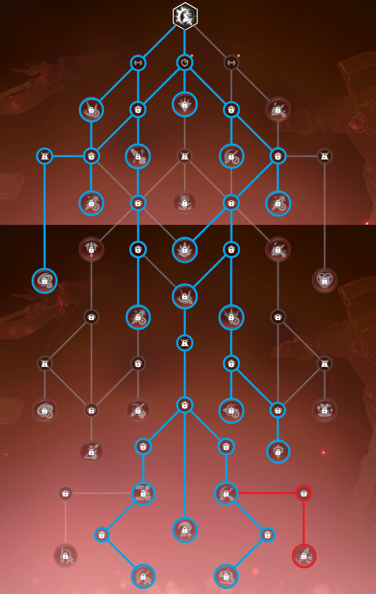

# BPSR: Skyward (Aerial) Wind Knight Season 2 Guide

* [Intro](#intro)
* [S2Armband](#s2armband)
  * [Illusion Factor](#illusion-factor)
* [Stats and Gear](#stats-and-gear)
  * [Imprints](#imprints)
  * [120 Gear](#120-gear)
  * [140 Gear](#140-gear)
  * [160 Gear](#160-gear)
* [Modules](#modules)
  * [Life Wave Activation](#life-wave-activation)
* [Imagines](#imagines)
  * [Lv120](#lv120)
  * [Lv140 / Lv160](#lv140--lv160)
  * [New player](#new-player)
* [Rotation and Talent Tree](#rotation-and-talent-tree)
  * [Non-Typhoon: Sharp Impact (3 Sharp SI)](#non-typhoon-sharp-impact-3-sharp-si)
  * [Typhoon: Sharp Impact (6 Sharp SI)](#typhoon-sharp-impact-6-sharp-si)

## Intro

Season 2 comes with a few new systems and skill changes that make playing Skyward a bit different than in season 1, but the core of the class is still the same, thus for this guide I will focus on only the new stuff.

Similar to season 1, the experience in global and other regions will be vastly different than the experience CN had due to the large number of bugs when new contents and systems come online, frequent bug fixes and updates that are directly impacting class balance, and the large mid season class balance update. By the time CN got stable with bugs and class balance changes it had already reached mid game (Lv 140 gear). For global and other regions they would have all these changes at the start of the season if it follows the same pattern as season 1.

With that being said this guide will be targeted at mid game (Lv140) and beyond, the CN player base never had the chance to experience early game with the current changes and class balance. Because of that, for early game Lv120 gear there could be builds that are more optimal than what's outlined in this guide.

## S2Armband

(Don't know the official translation yet, so referring to it as S2Armband)

This is the new system that equivalent to seaon 1's armband. Only three options are worth considering for Skyward: trMHZL, trJM, trMJ. Each of these options are timegated, as the season progress they unlock from left to right, top to bottom.

Within each option is a tree with a few branching points, those nodes in the tree are also timegated.

Use trMHZL at the start of the season. When trJM unlocks, either keep using trMHZL or switch to trJM. Switch to trMJ when it unlocks for final build.

For trMJ branches select the following :
- Reduce CD (left)
- +15% damage, max stack +2 (right)
- Ignore defense (right)
- +30% food buff time (left)

- trMHZL This is the first one that gets unlocked, good to use for early game
- trMJ This gets unlocked later, and it will be the best S2Armband for Skyward
- trJM This used to be a viable option too but it has since been nerfed, and on top of that it's usually used by tank, which allows everyone in the party to get partial benefit, so when a dps also use it its value is diminished on the dps. This should only be considered when trMJ is still locked behind timegate.

### Illusion Factor

In the S2Armband we select 2 class Illusion Factor and 3 common attack Illusion Factor

Class specific ones pick these 2:
- Galeform extension
- Tornado trigger lucky hit
    - In Lv120 gear our luck % is too low to take advange of Tornado lucky hit, and our crit % is too low to do rotation consistently, so instead of Tornado lucky hit, we use Sharp Impact auto charge.

Common attack pick these 3:
- Mastery convert to Crit (Crit raw %+, Mastery raw %-)
- Strength
- All element damage

Defense ones doesn't really matter too much, personally I use:
- Common defense: No damage taken for 8 seconds max health goes up (for triggering life wave)
- Common defense: All element resist
- Class defense: Damage reduction during Galeform

## Stats and Gear

### Imprints

This section is just a general explanation for the imprint system, you can skip over it if you only care about Skyward build.

Imprints are the same as gems that you put in gear in season 1, the difference is how you obtain them. In season 1 you craft them with life skill, in season 2 you have to kill normal mobs, elite, and world boss to get them.
- Normal mobs will have a chance to drop blue imprints when you kill them.
- When using keys to open elite chest there's a chance to get purple imprints.
- When using keys to open boss chest there's a chance to get gold imprints.
- Imprints can also be obtained from the exchange NPC by using imprints fragments, which you can get by recycling imprints, and by opening elite and boss chests.

Different imprints gives different stat and can only be sloted in their designated gear piece.
Here's what imprint can go in what gear and their possible rolls (the roll chances are the same as season 1 at 60% / 35% / 5%):

- Blue
    - Helmet, Chest, Gloves, Boots
        - Substat rolls: 200 / 250 / 300
    - L/R Bracelets, Charm
        - Substat rolls: 140 / 175 / 210

- Purple
    - L/R Bracelets, Charm
        - Substat rolls: 300 / 360 / 420

- Gold
    - Helmet, Chest, Gloves, Boots
        - Substat rolls: 500 / 560 / 600

There are also imprints that gives main stat, which go on earrings, necklace and ring. And imprint that gives all element attack, which goes on weapon, but since they are not that relevant in terms of stat planning I didn't include their values here.

### 120 Gear

TLDR: Get as much crit as you can, get high crit on all pieces that can have crit, reforge 3rd stat to crit on all pieces and imprint crit on all pieces that can have crit imprints.

With 120 gear your crit will be quite low, if you get crit on every piece of gear that can have crit, and put on decent imprints, you will barely make high 30s to low 40s percent crit, so without all the right gear pieces most people will be around low to mid 30s percent.

Assuming you have high crit roll on all pieces except L/R bracelets, this is the final crit rate with different imprints:

| Imprint Configuration                                                         | All Imprints Roll Lowest | All Imprints Roll Highest |
|:------------------------------------------------------------------------------|:------------------------:|:-------------------------:|
| **Blue** on helmet, armor, gloves, boots
**Blue** on L/R bracelets, charm   | 38.12%                   | 39.54%                    |
| **Blue** on helmet, armor, gloves, boots
**Purple** on L/R bracelets, charm | 39.24%                   | 40.93%                    |
| **Gold** on helmet, armor, gloves, boots
**Purple** on L/R bracelets, charm | 41.88%                   | 43.44%                    |

You can acutally get mid to high 40 percent crit by using Life Wave module, but you need to ensure your crit is your highest substat. This means for people with T5 Goblin King you would have to either not use Goblin King until later, or not use Life Wave, since as you can see even with the best gear and best imprints you cannot reach 44.44% crit.

If you are reading this and are still in the middle of building your Goblin King, and you have Lv6 Life Wave module, it could be wise to hold off upgrading your GK going into season 2 and keeping your vers lower than your crit until Lv140 gear comes out. Once Lv140 gear becomes available it's easy to get above 44.44% crit.

You can actually keep using Lv80 raid L/R bracelets to get a bit more crit and you will be doing that until the bracelet dungeon comes out (assuming they don't change dungeon release schedule from CN). But once 120 bracelets are available you will be trading _Illusion_Strength_ and strength for crit, which might not be worth it in the end, and the crit you get is very minimal (400 raw crit, if you have 39.24% crit, you will go from 39.24% to 40.14%).

(note: These value might not be reachable before 140 gear comes out, since they include the 800 crit stat from S2Armband, which is also timegated)

### 140 Gear

- Weapon options:
    - Gold weapon with high Crit low Haste and 3.5% Atk / Attack Speed.
    - Crafted red weapon.

- Gear Purple Lines:
    - Accessory purple line should be 2% Atk, 2% Attack Speed is fine too if your attack speed is low (<40%).
    - Armor purple line should be 1.5% Strength.

- Gear Substats:
    - Crit / Haste on helmet, chest and boots, only need 2 out of the 3.
    - High Crit low Mastery or high Crit low Luck on necklace.
        - The low roll on necklace is actually not very impactful, as long as you have high Crit and 2% atk / attack speed it's good enough.
    - Crit / Haste on Earring, Ring and Charm.
    - 4pc raid gear set on L/R bracelets, gloves and one of helmet, chest or boots.

6pc raid gear set is also an option, it won't be much worse than 4pc + two of 1.5% strength pefect gear setup because raid gear can be upgraded to Lv150, which gives more stat. And compared to farming 1.5% strength perfect gear it is much easier.

- For T5 Goblin King + Life Wave:
    - Aim for 44.45% crit, then the rest into haste, luck should only come from red weapon and raid gear set.

- For non-Life Wave:
    - Aim to get crit to high 40% close to 50% if you want to play the [3 Sharp SI build](#typhoon-sharp-impact-6-sharp-si), otherwise you can just leave it around 44-45%, though you really should try to get Life Wave for the 3 Sharp SI build.

- For Haste Image:
    - Aim for mid 50s to low 60s attack speed, and the rest into crit while keeping a small amount of stat in both mastery and versatility (~10%).
    - For pGoat it's fine to keep building haste at this point, even at around 60% attack speed we don't run out of resource. If you have Life Wave aim to keep your crit higher than your haste with imagine active. T5 pGoat's active is +13% haste, so your crit needs to be greater than normal haste + 13% + 5% (Divine Concealment).
    - If you have T5 Celestial Flier and Life Wave, it's actually quite hard to keep crit higher than haste with CF's active espeically you also have crit / haste gear, since T5 CF gives +20% haste.

### 160 Gear

This section will come at a later time.

## Modules

TLDR: Life Wave >>> Damage Stack > Strength Boost > Attack Speed ~= Crit Focus ~= Elite Strike

- Life Wave
    - This module is much stronger than every other module for this class in season 2. See [Rotation](#rotation-and-talent-tree) for more details.
- Damage Stack
- Strength Boost
- Attack Speed
    - Similar to season 1, when your attack speed is low this module can be much better than Crit Focus and Elite Strike.
- Crit Focus / Elite Strike

For the majority of the players, your goal should just be getting a 66 with Life Wave. Getting anything higher than that requires either a lot of luck or a lot of money. If you do not have Life Wave then use 666 or 665 following the [season 1 modules](README.md#modules). In most cases Life Wave 66 is stronger 666 with no Life Wave no Damage Stack.

### Life Wave Activation

The best and most consistent way to ensure having high Life Wave uptime is to have a lifebind healer in the party, as long as you are getting healed by a lifebind, your life wave will be active (90+% uptime).

## Imagines

Out of all the new season 2 imagines, only the pGoat is worth using, it replaces Muku Scout and T0-2 Celestial Flier. If you are already running double T5 gold then you can skip it.

### Lv120

Lv120 Best to Worst

(Assuming all gold imagines are equal level, and all purple are T5)

1. 
     
1. 
     
1. 
     
1. 
     
1. 
     

In Lv120 when stat is lacking, stat imagines are better than the non-stat imagines in general (Goblin King, Celestial Flier, pGoat).
For most of early game with Lv120 gear the lower crit rate makes Muku Chief's value much lower. Ideally you want to use Celestial Flier / pGoat, and swap in Muku Chief at around Lv140 gear when your crit rate is higher than 40%.

For people that use one gold one purple, in Lv120 gear pGoat is better than Muku Scout, but in higher level gear (around the start of Lv160) when you can get a lot of haste from gear Muku Scout would be better.

As mentioned in [120 Gear](#120-gear) section, if you are using Life Wave you want to make sure your crit is the highest substat. This might be difficult to achieve with Lv120 gear, so if you have imagines that are preventing Life Wave from activating on crit, you could consider using something else if you have the options (i.e. swapping out Goblin King and use Muku Chief instead, with Life Wave active on crit Mukuk Chief's value increases).
That being said, Life Wave is not going to make make your T1 Muku Chief out perform your T5 Goblin King, so if you invested heavily in one and only one gold imagine, it's still best to use that and not use Life Wave until Lv140 gear.

### Lv140 / Lv160

Lv140 / Lv160 Best to Worst

1. 
     
1. 
      About the same as the above MC + GK in Lv140, but as we transition into Lv160 MC + GK will start to outperform.
1. 
     
1. 
     
1. 
     
1. 
      Muku Scout should start to outperform pGoat in Lv160 gear.
1. 
     

### New player

If you are a new player starting from season 2 then this is your only real options.

 

## Rotation and Talent Tree

### Non-Typhoon: Sharp Impact (3 Sharp SI)

The difference between the two build is highlighted in red.

This is the current season 2 meta build, but it need quite a lot of stat to perform well. The most important thing is to have high crit rate (~55%). This is achieved by having ~45% crit and having Lv6 Life Wave for the last 10%. If your crit rate is only around 45% (without Life Wave active), then this build won't really outperform the [6 Sharp SI Build](#typhoon-sharp-impact-6-sharp-si).

The idea of this build is to use high crit rate to generate more Chasing Step procs, which boosts Instant Edge damage and crit rate and generates more Sharp refunds. This in turns reduces the amount of Skyfall per rotation. The time spent doing Skyfall during our rotation is considered "garbage time" because of its long animation time and minimal damage. The more we can reduce this garbage time and shorten our rotation, the higher our dps can reach.

things to explain
- Falcon Toss
- Divine Concealment buff
- Momentum Surge

### Typhoon: Sharp Impact (6 Sharp SI)

