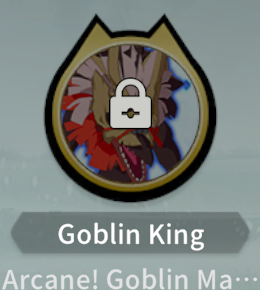

# BPSR: Skyward (Aerial) Wind Knight Comprehensive Guide (Season 2)

[Season 1 Guide Here](S1.md#bpsr-skyward-aerial-wind-knight-comprehensive-guide-season-1)

If you just want to see the rotation video: [Rotation Video](#rotation-video)

* [Intro](#intro)
* [S2Armband](#s2armband)
  * [Phantom Factor](#phantom-factor)
    * [Early Lv120 Class Factors](#early-lv120-class-factors)
    * [Lv140+ Class Factors](#lv140-class-factors)
    * [Common Attack Factors](#common-attack-factors)
    * [Defense Factors](#defense-factors)
* [Stats and Gear](#stats-and-gear)
  * [Sigils](#sigils)
  * [120 Gear](#120-gear)
  * [140 Gear](#140-gear)
  * [160 Gear](#160-gear)
* [Modules](#modules)
  * [Life Wave Activation](#life-wave-activation)
* [Imagines](#imagines)
  * [Lv120](#lv120)
  * [Lv140 / Lv160](#lv140--lv160)
  * [New player](#new-player)
* [Rotation and Talent Tree](#rotation-and-talent-tree)
  * [Lv120 Early Early Game](#lv120-early-early-game)
  * [Lv120 Early Game](#lv120-early-game)
  * [Typhoon: Sharp Impact (6 Sharp SI)](#typhoon-sharp-impact-6-sharp-si)
  * [Non-Typhoon: Sharp Impact (3 Sharp SI)](#non-typhoon-sharp-impact-3-sharp-si)
    * [Rotation Video](#rotation-video)
  * [Rotation](#rotation)
  * [Other Things to Consider](#other-things-to-consider)
  * [Damage Breakdown Reference](#damage-breakdown-reference)
* [Updates](#updates)

## Intro

Season 2 comes with a few new systems and skill changes that make playing Skyward a bit different than in season 1, but the core of the class is still the same, thus for this guide I will focus on only the new stuff.

Similar to season 1, the experience in global and other regions will be vastly different than the experience CN had due to the large number of bugs when new contents and systems come online, frequent bug fixes and updates that are directly impacting class balance, and the large mid season class balance update. By the time CN got stable with bugs and class balance changes it had already reached mid game (Lv 140 gear). For global and other regions they would have all these changes at the start of the season if it follows the same pattern as season 1.

With that being said this guide will be targeted at mid game (Lv140) and beyond, the CN player base never had the chance to experience early game with the current changes and class balance. Because of that, for early game Lv120 gear there could be builds that are more optimal than what's outlined in this guide.

## S2Armband

(Don't know the official translation yet, so referring to it as S2Armband)

This is the new system that equivalent to seaon 1's armband. Only three options are worth considering for Skyward: Dreamforce, Oblivion Dream, Phantom Arrow. Each of these options are timegated, as the season progress they unlock from left to right, top to bottom.

Within each option is a tree with a few branching points, those nodes in the tree are also timegated.

Use Dreamforce at the start of the season. When Oblivion Dream unlocks, either keep using Dreamforce or switch to Oblivion Dream. Switch to Phantom Arrow when it unlocks for final build.

Phantom Arrow's main effect:

When using damage type expertise skill (Falcon, Instant Edge, Sharp Impact, Galeform) summons Phantom Arrow, this effect can trigger once every 7 seconds. Each time this is triggered the next summon will increase arrow count by 1, up to a max of 8 arrows (later on in the tree there's a branch that increases the max up to 10). Each time special attack (Skyfall) is used, it reduces the cooldown by 0.6 second. As long as you are continously performing rotation, you will be maximizing the effect of Phantom Arrow.

For Phantom Arrow branches select the following :
- Reduce CD (left)
- +15% damage, max stack +2 (right)
- Ignore defense (right)
- +30% food buff time (left)

- Dreamforce This is the first one that gets unlocked, good to use for early game
- Phantom Arrow This gets unlocked later, and it will be the best S2Armband for Skyward
- Oblivion Dream This used to be a viable option too but it has since been nerfed, and on top of that it's usually used by tank, which allows everyone in the party to get partial benefit, so when a dps also use it its value is diminished on the dps. This should only be considered when Phantom Arrow is still locked behind timegate.

### Phantom Factor

In the S2Armband we select 2 class specific Phantom Factors and 3 common attack Phantom Factors.

#### Early Lv120 Class Factors

Pick 2 out of these 3 depending on what you need

|      | Galeform extension | Must have  |
|:-:|:-:|:--|
|   | Sharp Impact auto charge | In Lv120 without raid gear luck % is too low to take advange of Tornado lucky hit, and crit % is also too low to do rotation consistently. Instead of Tornado lucky hit, using Sharp Impact auto charge is a better option. This factor should be swapped out once rotation is consistent (getting at least 2 Chasing Steps per rotation). **This should be your number 1 priority factor if you crit is less than 30%** |
|         | Azure guarantee crit | If you no longer need Sharp Impact auto charge, use this until your luck is high enough then switch to Tornado lucky hit (around 3-4 piece of raid gear). |

#### Lv140+ Class Factors

|      | Galeform extension | Must have  |
|:-:|:-:|:--|
|      | Tornado trigger lucky hit | Must have  |

#### Common Attack Factors

|      | Convert Mastery to Crit |
|:-:|:--|
|      | Increase strength |
|      | Increase all element damage |

#### Defense Factors

Defense factors don't really matter too much, personally I use:

|      | No damage taken for 8 seconds max health goes up (for triggering life wave) |
|:-:|:--|
|      | All element resist |
|      | Damage reduction during Galeform (Class Defense Factor) |

## Stats and Gear

### Sigils

This section is just a general explanation for the sigil system, you can skip over it if you only care about Skyward build.

Sigils are the same as gems that you put in gear in season 1, the difference is how you obtain them. In season 1 you craft them with life skill, in season 2 you have to kill normal mobs, elite, and world boss to get them.
- Normal mobs will have a chance to drop blue sigils when you kill them.
- When using keys to open elite chest there's a chance to get purple sigils.
- When using keys to open boss chest there's a chance to get gold sigils.
- Sigils can also be obtained from the exchange NPC by using sigils fragments, which you can get by recycling sigils, and by opening elite and boss chests.

Different sigils gives different stat and can only be sloted in their designated gear piece.
Here's what sigil can go in what gear and their possible rolls (the roll chances are the same as season 1 at 60% / 35% / 5%):

- Blue
    - Helmet, Chest, Gloves, Boots
        - Substat rolls: 200 / 250 / 300
    - L/R Bracelets, Charm
        - Substat rolls: 140 / 175 / 210

- Purple
    - L/R Bracelets, Charm
        - Substat rolls: 300 / 360 / 420

- Gold
    - Helmet, Chest, Gloves, Boots
        - Substat rolls: 500 / 560 / 600

- Weapon Sigil
    - You can get a gold weapon Sigil (+ all element attack) from Basilisk, and it's the best sigil you can put on weapon, but I'd skip that on Lv120 weapon and wait until Lv140/150.

There are also sigils that gives main stat, which go on earrings, necklace and ring. And sigil that gives all element attack, which goes on weapon, but since they are not that relevant in terms of stat planning I didn't include their values here.

### 120 Gear

TLDR: Get as much crit as you can, get high crit on all pieces that can have crit, reforge 3rd stat to crit on all pieces and sigil crit on all pieces that can have crit sigils.

With 120 gear your crit will be quite low, if you get crit on every piece of gear that can have crit, and put on decent sigils, you will barely make high 30s to low 40s percent crit, so without all the right gear pieces most people will be around low to mid 30s percent.

Assuming you have high crit roll on all pieces except L/R bracelets, this is the final crit rate with different sigils:

| Sigil Configuration                                                         | All Sigils Roll Lowest | All Sigils Roll Highest |
|:------------------------------------------------------------------------------|:------------------------:|:-------------------------:|
| **Blue** on helmet, armor, gloves, boots **Blue** on L/R bracelets, charm   | 38.12%                   | 39.54%                    |
| **Blue** on helmet, armor, gloves, boots **Purple** on L/R bracelets, charm | 39.24% | 40.93%                    |
| **Gold** on helmet, armor, gloves, boots **Purple** on L/R bracelets, charm | 41.88%                   | 43.44%                    |

Breakdown on the 39.24% option:

You can acutally get mid to high 40 percent crit by using Life Wave module, but you need to ensure your crit is your highest substat. This means for people with T5 Goblin King you would have to either not use Goblin King until later, or not use Life Wave, since as you can see even with the best gear and best sigils you cannot reach 44.44% crit.

If you are about to upgrade your T3 Goblin King to T4/5, and you have Lv6 Life Wave module, it could be wise to hold off upgrading your GK going into season 2 and keeping your vers lower than your crit until Lv140 gear comes out. Once Lv140 gear becomes available it's easy to get above 44.44% crit.

You can actually keep using Lv80 raid L/R bracelets to get a bit more crit and you will be doing that until the bracelet dungeon comes out (assuming they don't change dungeon release schedule from CN). But once 120 bracelets are available you will be trading Illusion Strength and strength for crit, which might not be worth it in the end, and the crit you get is very minimal (400 raw crit, if you have 39.24% crit, you will go from 39.24% to 40.14%).

(note: These value might not be reachable before 140 gear comes out, since they include the 800 crit stat from S2Armband, which is also timegated)

### 140 Gear

- Weapon options:
    - Gold weapon with high Crit low Haste and 3.5% Atk / Attack Speed.
    - Crafted red weapon.

- Gear Purple Lines:
    - Accessory purple line should be 2% Atk, 2% Attack Speed is fine too if your attack speed is low (<40%).
    - Armor purple line should be 1.5% Strength.

- Gear Substats:
    - Crit / Haste on helmet, chest and boots, only need 2 out of the 3.
    - High Crit low Mastery or high Crit low Luck on necklace.
        - The low roll on necklace is actually not very impactful, as long as you have high Crit and 2% atk / attack speed it's good enough.
    - Crit / Haste on Earring, Ring and Charm.
    - 4pc raid gear set on L/R bracelets, gloves and one of helmet, chest or boots.
    - For the Crit / Haste pieces, it doesn't matter which stat gets high roll, you can adjust with 3rd reforge roll and sigils to reach your desire crit and haste %.

- Raid Gear Set:
    - Get L / R bracelets pieces asap, this will be the biggest boost to your crit.
    - 2pc effect: When luck strike is triggered, Galeform CD reduce by 0.2s. When casting Galeform while Galeform is still active, immediately gains the remaining courage from the active Galeform and triggers Tempestrike.
    - 4pc effect: After using Galeform, the next Skyfall and Instant Edge get +70% wind damage.

6pc raid gear set is also an option, it won't be much worse than 4pc + two of 1.5% strength pefect gear setup because raid gear can be upgraded to Lv150, which gives more stat. And compared to farming 1.5% strength perfect gear it is much easier.

- For T5 Goblin King + Life Wave:
    - Aim for 44.45% crit, then the rest into haste, luck should only come from red weapon and raid gear set.

- For non-Life Wave:
    - Aim to get crit to high 40% close to 50% if you want to play the [3 Sharp SI build](#typhoon-sharp-impact-6-sharp-si), otherwise you can just leave it around 44-45%, though you really should try to get Life Wave for the 3 Sharp SI build.

- For Haste Image:
    - Aim for mid 50s to low 60s attack speed, and the rest into crit while keeping a small amount of stat in both mastery and versatility (~10%).
    - For pGoat it's fine to keep building haste at this point, even at around 60% attack speed we don't run out of resource. If you have Life Wave aim to keep your crit higher than your haste with imagine active. T5 pGoat's active is +13% haste, so your crit needs to be greater than normal haste + 13% + 5% (Divine Concealment).
    - If you have T5 Celestial Flier and Life Wave, it's actually quite hard to keep crit higher than haste with CF's active espeically you also have crit / haste gear, since T5 CF gives +20% haste.

### 160 Gear

This section will come at a later time.

## Modules

TLDR: Life Wave >>> Damage Stack > Strength Boost > Attack Speed ~= Crit Focus ~= Elite Strike

- Life Wave
    - This module is much stronger than every other module for this class in season 2. See [Rotation](#rotation-and-talent-tree) for more details.
- Damage Stack
- Strength Boost
- Attack Speed
    - Similar to season 1, when your attack speed is low this module can be much better than Crit Focus and Elite Strike.
- Crit Focus / Elite Strike

For the majority of the players, your goal should just be getting a 66 with Life Wave. Getting anything higher than that requires either a lot of luck or a lot of money. If you do not have Life Wave then use 666 or 665 following the [season 1 modules](s1.md#modules). In most cases Life Wave 66 is stronger 666 with no Life Wave no Damage Stack.

### Life Wave Activation

The best and most consistent way to ensure having high Life Wave uptime is to have a lifebind healer in the party, as long as you are getting healed by a lifebind, your life wave will be active (90+% uptime).
This is from lifebind's 2pc set effect, which changes your max hp everytime they heal you.

## Imagines

Out of all the new season 2 imagines, only the pGoat is worth using, it replaces Muku Scout and T0-2 Celestial Flier. If you are already running double T5 gold then you can skip it.

### Lv120

Lv120 Best to Worst

(Assuming all gold imagines are equal level, and all purple are T5)

1. 
     
1. 
     
1. 
     
1. 
     
1. 
     

In Lv120 when stat is lacking, stat imagines are better than the non-stat imagines in general (Goblin King, Celestial Flier, pGoat).
For most of early game with Lv120 gear the lower crit rate makes Muku Chief's value much lower. Ideally you want to use Celestial Flier / pGoat, and swap in Muku Chief at around Lv140 gear when your crit rate is higher than 40%.

For people that use one gold one purple, in Lv120 gear pGoat is better than Muku Scout, but in higher level gear (around the start of Lv160) when you can get a lot of haste from gear Muku Scout would be better.

As mentioned in [120 Gear](#120-gear) section, if you are using Life Wave you want to make sure your crit is the highest substat. This might be difficult to achieve with Lv120 gear, so if you have imagines that are preventing Life Wave from activating on crit, you could consider using something else if you have the options (i.e. swapping out Goblin King and use Muku Chief instead, with Life Wave active on crit Mukuk Chief's value increases).
That being said, Life Wave is not going to make make your T1 Muku Chief out perform your T5 Goblin King, so if you invested heavily in one and only one gold imagine, it's still best to use that and not use Life Wave until Lv140 gear.

### Lv140 / Lv160

Lv140 / Lv160 Best to Worst

1. 
     
1. 
      About the same as the above MC + GK in Lv140, but as we transition into Lv160 MC + GK will start to outperform.
1. 
     
1. 
     
1. 
     
1. 
      Muku Scout should start to outperform pGoat in Lv160 gear.
1. 
     

### New player

If you are a new player starting from season 2 then this is your only real options.

 

## Rotation and Talent Tree

These are the builds for season 2, the difference is highlighted in yellow. From left to right each build requires more stat (crit) with the right most build being current end game higest damage potential build.

| Lv 120 Early Early Game | Lv120 Early Game | Typhoon (6 Sharp SI) (Less Than 50% Crit) | Non-Typhoon (3 Sharp SI) (More Than 50% Crit) |
|:-:|:-:|:-:|:-:|
|  |  |  |  |

The builds are called Typhoon and Non-Typhoon based on if the Typhoon: Sharp Impact node is selected.

### Lv120 Early Early Game

This is for super early week(s) of season 2 when your crit is not even 30%. You can use this build along with the [Sharp Impact Class Attack Factor](#early-lv120-class-factors), and use the seaon 1 rotation. With this build you only need to get 1 chasing step per rotation, if at the end of the rotation you got 1 chasing step and your sharp impact is not charged, you just left click attack and save your courage until the Sharp Impact factor charges the last bit for you (worst case is you get stuck on the ground waiting for charge for 8.8s with G4 factor, but most of the time you don't have to wait that long).

### Lv120 Early Game

This build is for early game when your crit is severly lacking.

### Typhoon: Sharp Impact (6 Sharp SI)

This build is for less than 50% crit, 50% is not a hard cut off either, it's based on trial and error and 50% is around where the Non-Typhoon build starts to do consistently more damage.

### Non-Typhoon: Sharp Impact (3 Sharp SI)

#### Rotation Video

Video that goes through the Non-Typhoon Rotation:

This is the current season 2 meta build, but it need quite a lot of stat to perform well. The most important thing is to have high crit rate (~55%). This is achieved by having ~45% crit and having Lv6 Life Wave for the last 10%. If your crit rate is only around 45% (without Life Wave active), then this build won't really outperform the Typhoon build.

The idea of this build is to use high crit rate to generate more Chasing Steps, which boosts Instant Edge damage and crit rate and generates more Sharp refunds. This in turns reduces the amount of Skyfall needed per rotation.

### Rotation

1a. Falcon Toss (if available, otherwise jump cancel) > Sharp Impact. For running Lv120 or Typhoon build.
1b. Falcon Toss (if available) > Skyfall (until at 2 or 3 Sharp) > Sharp Impact. For running Non-Typhoon build.

2. All Imagines > Galeform
3. 1x Instant Edge > Skyfall until 6 Sharp
4. 2x Instant Edge
5. Azure > Skyfall until 6 Sharp
6. 2x Instant Edge
7. Repeat from 1.

This is the core of the rotation, it's basically the same as season 1 with the added Falcon Toss at the very beginning. But there are nuances with this rotation and places that can be optimized and some on the fly decision making.
- In step 3, while you Skyfall if you reach 5 Sharp and already have 2 Chasing Steps then you want to go to step 3. Anytime you cast Skyfall with 2 Chasing Steps is a potenial resource loss. Although when your attack speed is high you still want to always Skyfall till 6 Sharp in step 3.
- By the end of step 4, if you had proc'd 3 Chasing Step, and your Sharp Impact will be charged after one more Instant Edge, then you want to Azure > Instant Edge, and start the next rotation right after. This makes it into a 4 Instant Edge rotation.

### Other Things to Consider

- Falcon Toss
    - Only use Falcon Toss at the start of a rotation while standing on the ground, because ground Falcon Toss will have two hits, as long as one of those hits crit you will get one (and only one) Chasing Step proc. Assuming 50% crit rate, this means a ground Falcon Toss will have a 75% chance to proc Chasing Step. So always use it on the ground at the start of a rotation when it's available.
- Galeform
    - With the Galeform duration extension Phantom Factor and the raid gear set effect, you don't have to wait until it ends before using it. In early game you still have to be somewhat conservative with Galeform due to low crit and low level factor, once we are in mid game you can be more liberal on its use. On top of that it's not necessary to use it right before Instant Edge anymore, since fitting 6 or 7 Instant Edges into Galeform window is no longer a thing.
    - With the raid 4pc effect, you want to refresh Galeform only when you have Chasing Step proc (best case being when you have double Chasing Step). This is because you want to make sure the Instant Edge with +70% wind damage after Galeform is buffed by Chasing Step. Try to do this as much as possible without wasting resource (i.e. using Skyfall at max Sharp just to try to get proc), and without losing Galeform uptime (i.e. holding Galeform too long in order to wait for proc).
- Divine Concealment
    -  This is what the buff looks like on top of your skill bar.
    - It is from one of the talents in the base windknight tree. It's a 5 second buff that gives 1% haste per stack up to 5 stacks, and we gain a stack and refresh the buff everytime we consume Courage. It converts to 8% attack speed as long as you can keep up the buff. In season 1 this buff would drop everytime when a rotation starts, but with the rotation outlined above it's possible to keep it active at max stack as long as you have enough attack speed.
    - At Around 38% attack speed is possible to keep it active (maybe even lower), but it's quite difficult, 40%+ would be more comfortable. The only time this buff would drop is when you cast double imagines after Sharp Impact.
    - To prevent dropping the buff you need to minimize the time between the last Skyfall of the current rotation and the first Falcon Toss / Skyfall of the next rotation, this is the part that's most likely to drop espeically on a 4 Instant Edge rotation. Unlike season 1 you **don't** want to use Galeform right before Instant Edge, because that increases the time between Courage consuming skills, instead you want to use it when you have 4 or 5 Sharps so that you will still need to do one more Skyfall after Galeform.

### Damage Breakdown Reference

The skill 7997 is Phantom Arrow.

These two parses are done with the following setup:
- 54.07% crit (with Life Wave active), 38.76% attack speed 33.14% luck.
- T5 Muku Chief and T3 Goblin King
- Life Wave 6 Strength Boost 6 modules

Parse one: this is from the same parse showed in the video above.

Parse two:

## Updates

- 01/19/26
    - Update comment on Sharp Impact Class Factor
    - add [Lv120 Early Early Game](#lv120-early-early-game)

